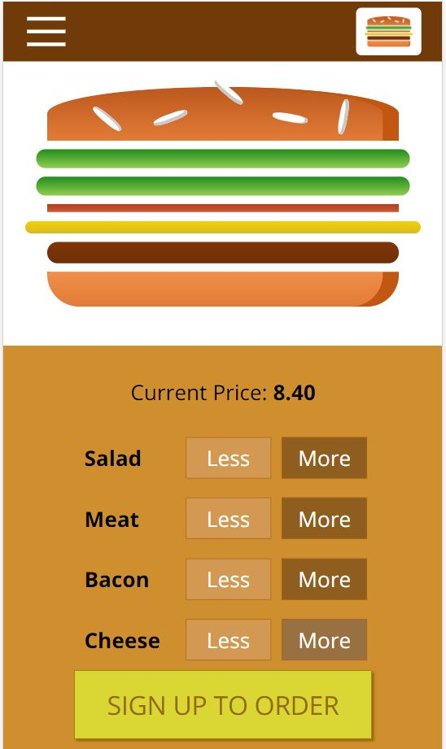
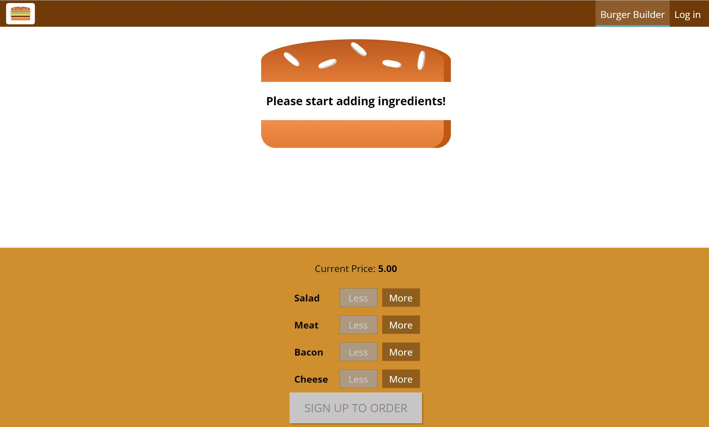

## Burger Builder Application

The responsive app allows to build a burger while culculating and displays the cost of the order. A customer can sign up or login for a checkout. The app saves and displays order history for authenticated users.

# How to run
1. Clone or download the repository.
2. Run npm install to install the project dependencies.
3. Run the app using `npm start`.
4. The app will launch in your browser at the address http://localhost:3000/.

A [live version](https://pchelka84.github.io/burger-builder/) of the app.

## How to run
This app is a part of a brilliant course by Maximilian Schwarzmüller @ [React - The Complete Guide including Hooks, React Router, Redux](https://www.udemy.com/course/react-the-complete-guide-incl-redux).
